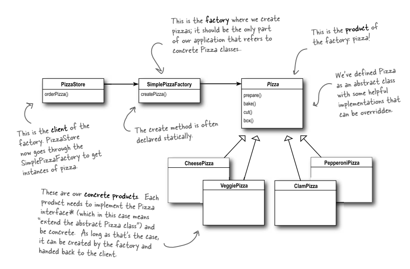

### Factory pattern

> The factory method pattern is a creational pattern that uses factory methods to deal with the problem of creating objects without having to specify the exact class of the object that will be created. This is done by creating objects by calling a factory method—either specified in an interface and implemented by child classes, or implemented in a base class and optionally overridden by derived classes—rather than by calling a constructor.

### Simple Factory

> The simple factory pattern is a creational pattern that provides a static method for creating objects. The method can be used to create objects without having to specify the exact class of the object that will be created. This is done by creating a factory class that contains a static method for creating objects.

### what are the problem 👍

1. SRP violations
2. OCP viloations
3. Complex logic around creation
4. Subclass usage
5. background incompatable
6. Not aware about subclass

> Factory : create objects without specifying subclass

If i want to create an instance from multiple subclasses on the basis of type/conditional

we have use **Sample factory**

### Algorithms

1. step-1:
   1. create your product interface
2. step-2:
   1. create your concreate classes
3. step-3:
   1. create your class factory
   2. create a static method for creating different type of objects
4. create Driver class for Test

|          | Prototype                                        | factory                                     |
| -------- | ------------------------------------------------ | ------------------------------------------- |
| def      | multiple instances without  recreating | single instances from multiples types  |
| subclass | still dependent on contructor/subclasses         | indepent of subclasses                      |

### Prototype + Factory =Factory method

1. step-1: create a functory class
2. create a concreate classes
3. then mapp with factory class
