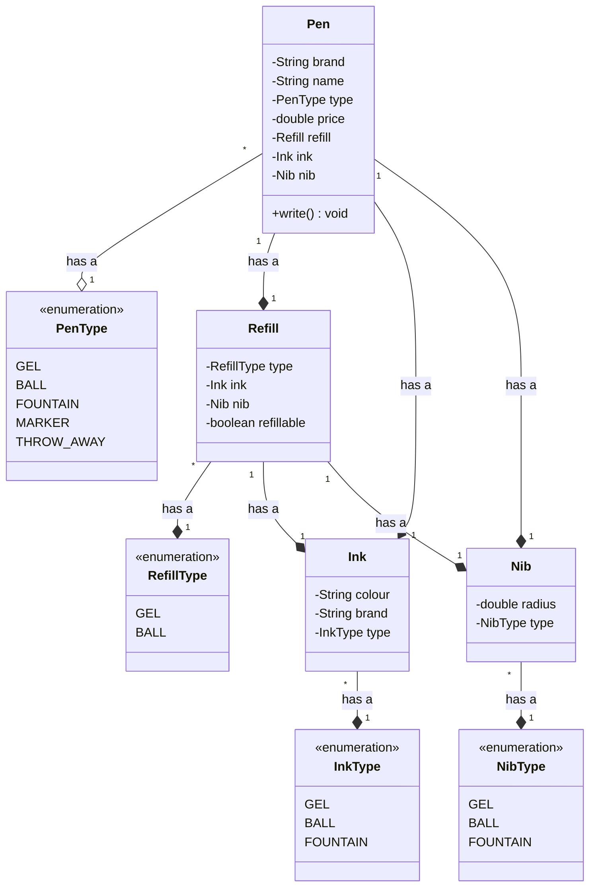

```mermaid
classDiagram

class Pen {
-String brand
-String name
-PenType type
-double price
-Refill refill
-Ink ink
-Nib nib
+write() void
}

    class PenType {
        <<enumeration>>
        GEL
        BALL
        FOUNTAIN
        MARKER
        THROW_AWAY
    }

    class Refill {
        -RefillType type
        -Ink ink
        -Nib nib
        -boolean refillable
    }

    class RefillType {
        <<enumeration>>
        GEL
        BALL
    }

    class Ink {
        -String colour
        -String brand
        -InkType type
    }

    class InkType {
        <<enumeration>>
        GEL
        BALL
        FOUNTAIN
    }

    class Nib {
        -double radius
        -NibType type
    }

    class NibType {
        <<enumeration>>
        GEL
        BALL
        FOUNTAIN
    }

    Pen "*" --o  "1" PenType : has a
    Pen "1" --* "1" Refill : has a
    Pen "1" --* "1" Ink : has a
    Pen "1" --* "1" Nib : has a

    Refill "*" --* "1" RefillType : has a
    Refill "1" --* "1" Ink : has a
    Refill "1" --* "1" Nib : has a

    Ink "*" --* "1" InkType : has a

    Nib "*" --* "1" NibType : has a


```
